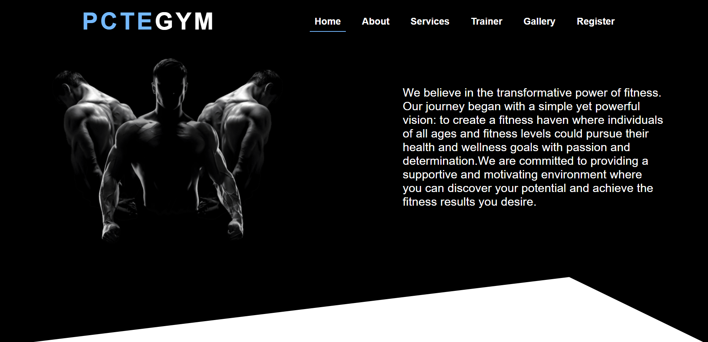
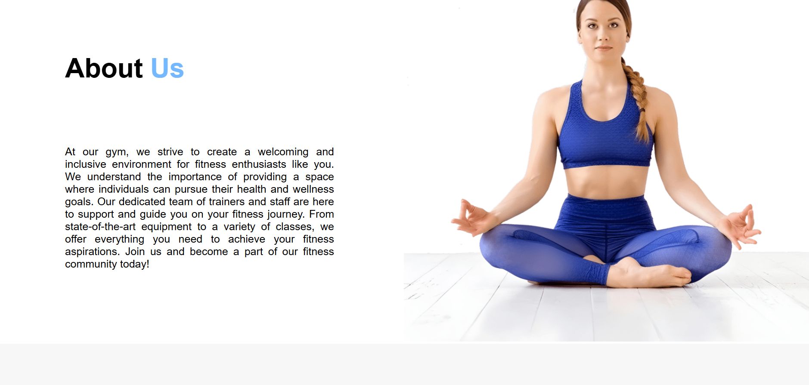
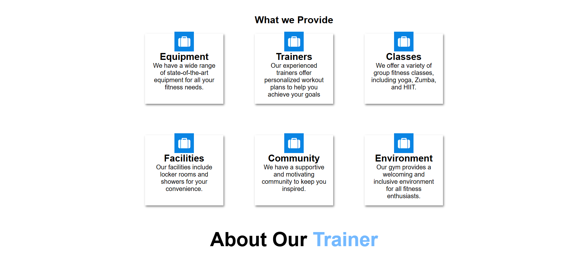
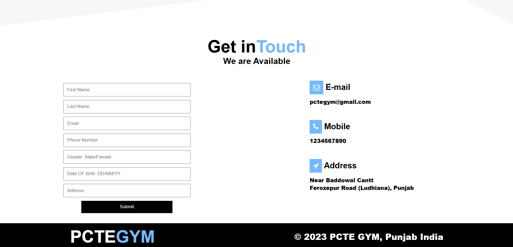

# 🏋️‍♂️ PCTE Gym Website

A responsive and modern gym website built using **HTML**, **CSS**, and **PHP**. This project is designed for a fictional gym, "PCTE GYM", and includes essential sections like home, about, services, trainers, gallery, and a registration form.

## 🚀 Features

- 🔷 Clean and responsive user interface
- 🔷 About us section describing gym philosophy
- 🔷 Services overview 
- 🔷 Trainer profile section
- 🔷 Gym image gallery
- 🔷 User registration form (connected via PHP)
- 🔷 Contact information with icons
- 🔷 Simple and clean layout with Font Awesome icons

## 💻 Technologies Used

- **HTML** – Markup structure  
- **CSS** – Styling and layout  
- **PHP** – Backend form submission  
- **Font Awesome** – Icons

1. Download or clone the repository:
   ```bash
   git clone https://github.com/your-username/pcte-gym.git
   
2. Open the folder in your code editor.
3. To test the PHP form:
    Use XAMPP, WAMP, or any local server.
    Place the folder inside the htdocs directory (if using XAMPP).
    Start Apache server.

## 🏋️‍♂️ Gym Website Screenshots

### 🏠 Home Page


### ℹ️ About Page


### 🛠️ Services Page


### 📞 Contact Page

